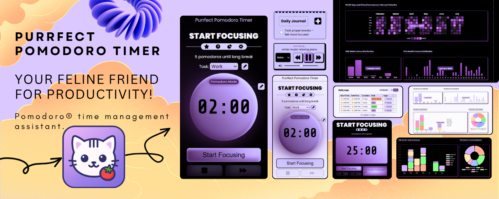

<p align="center">
  <a href="https://chromewebstore.google.com/detail/purrfect-pomodoro-timer-p/aobapnhgpjlldncjopmbbfeoomombhel">
    
  </a>
</p>
<h1 align="center">Purrfect Pomodoro Timer</h1>

<p align="center">
  A cat-themed Chrome extension for time management, focus sessions, and daily journaling.
</p>

<p align="center">
  <a href="https://chromewebstore.google.com/detail/purrfect-pomodoro-timer-p/aobapnhgpjlldncjopmbbfeoomombhel">
    
  </a>
  
  <a href="https://github.com/kartikth40/PurrfectFocus/actions/workflows/ci.yml">
    
  </a>
  <a href="https://github.com/kartikth40/PurrfectFocus/releases/latest">
    
  </a>
  
</p>


<p align="center">
  <a href="https://chromewebstore.google.com/detail/purrfect-pomodoro-timer-p/aobapnhgpjlldncjopmbbfeoomombhel">
    
  </a>
</p>

## Features

- 🍅 **Pomodoro Timer** - configurable focus, short break, and long break durations with auto-start options
- ⏱️ **Stopwatch Mode** - alternative free-running timer for flexible sessions
- 🎯 **Task Categories** - Work, Study, Personal, Chores, Other, Rest - with renamable aliases
- 🚫 **Site Blocking** - block distracting websites during focus sessions using declarativeNetRequest
- 🔔 **Notifications** - desktop notifications with 24 selectable alarm sounds per timer phase
- 🎵 **Music Player** - ambient background music streamed during sessions
- 📊 **Session History** - track your productivity with interactive charts (Chart.js)
- 🔥 **Streak Tracking** - visualize your daily consistency
- 📝 **Daily Journal** - lightweight to-do list to plan your day
- 💾 **Data Import/Export** - backup and restore your history as JSON
- 🌙 **Dark & Light Themes** - purple-toned UI with full theme support
- 📦 **Manifest V3** - built on the latest Chrome extension platform

## Tech Stack

| Layer | Technology |
|-------|-----------|
| Runtime | Vanilla JavaScript (ES Modules) |
| Styling | Vanilla CSS with custom properties |
| Build | Vite 6 + Rollup |
| Analytics | PostHog |
| Charts | Chart.js |
| Platform | Chrome Extension (Manifest V3) |

## Project Structure

```
src/
├── background.js      # Service worker - timer logic, messaging, site blocking
├── config.js          # External URLs and API keys
├── constants.js       # All constants, defaults, storage keys
├── utils.js           # Shared utilities across all pages
├── global.css         # Global styles and CSS variables
├── popup/             # Extension popup UI
├── newTab/            # Full-page timer overlay
├── settings/          # Settings page
├── history/           # Session history with charts
├── streak/            # Streak tracking
├── offScreen/         # Offscreen document for notification audio
└── userGuide/         # First-install guide
```

## Contributing

Found a bug or have a feature idea? [Open an issue](../../issues) - I'd love to hear from you.

Pull requests are welcome for bug fixes. For larger changes, please open an issue first to discuss.

## License

This project is licensed under a **non-commercial MIT license**. You're free to read, learn from, and modify the code for personal or educational use. Republishing it as a competing extension or using it commercially requires written permission. See [LICENSE](LICENSE) for details.

---

<p align="center">
  <a href="https://chromewebstore.google.com/detail/purrfect-pomodoro-timer-p/aobapnhgpjlldncjopmbbfeoomombhel">
    ⭐ Try it on the Chrome Web Store
  </a>
</p>
